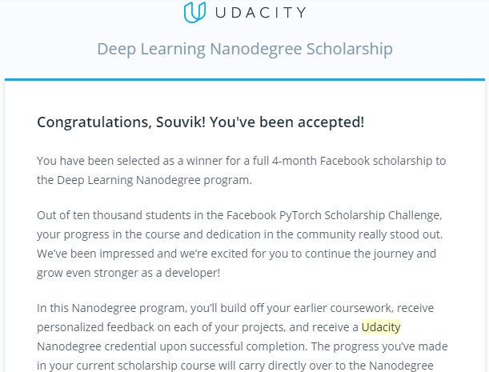

# PyTorch-Scholarship-Challenge

## Got Accepeted for Phase 2

## Day 1 | Course Introduction
Learned Classification Problem, Linear Boundaries, Higher Boundaries and Perceptron. Perceptron is pretty amazing it worked same as a Neuron.

## Day 2 | Entropy
Learned Error Function, Log-Loss Error Function and cross entropy. Among these cross entropy is the best way to get prediction.
Ipython Notebook for [Soft max and cross-Entropy](https://github.com/souvikb07/PyTorch-Scholarship-Challenge/blob/master/Lesson_2/Coding%20Softmax%20and%20Cross-entropy.ipynb) and [Perceptron](https://github.com/souvikb07/PyTorch-Scholarship-Challenge/blob/master/Lesson_2/Perceptrons.ipynb)

## Day 3 | Gradient Descent
Learned about gradient Descent and continuous perceptron. Ipython Notebook [Gradient Descent](https://github.com/souvikb07/PyTorch-Scholarship-Challenge/blob/master/Lesson_2/GradientDescent.ipynb)

## Day 4 | First Neural Network
Learned about the Neural Network Architure, Backpropogation, made my first neural network, Regularization and different activation function. The thing about neural network is that it is a combination of linear models and the maths behind every function is beautiful.
Ipython Notebook for [Student Admissions](https://github.com/souvikb07/PyTorch-Scholarship-Challenge/blob/master/Lesson_2/StudentAdmissions.ipynb)

## Day 5 | Neural Network using Pytorch
Build a neural network using Pytorch.
Ipython Notebook for [Neural Network](https://github.com/souvikb07/PyTorch-Scholarship-Challenge/blob/master/Lesson_4/Part%201%20-%20Tensors%20in%20PyTorch.ipynb)

## Day 6 | Neural Network Architectures
Build Neural Network Architecture and trained the model. Ipython notebook for [Neural Network](https://github.com/souvikb07/PyTorch-Scholarship-Challenge/blob/master/Lesson_4/Part%202%20-%20Neural%20Networks%20in%20PyTorch.ipynb) and [Training Neural Networks.](https://github.com/souvikb07/PyTorch-Scholarship-Challenge/blob/master/Lesson_4/Part%203%20-%20Training%20Neural%20Networks.ipynb)

## Day 7 | Classifying Fashion MNIST
Build a simple Neural Network from scratch to detect the type of clothes. I got to know that with very simple model you can also get goot accuracy.
Ipython Notebook of  [Fashion MNIST](https://github.com/souvikb07/PyTorch-Scholarship-Challenge/blob/master/Lesson_4/Part%204%20-%20Fashion-MNIST.ipynb)

## Day 8 | Dogs vs Cats
Build a simple Neural Network from scratch to detect that the image is of cat or dog. Learned about Inference and Validation and how to save and load a trained model. Also learned how to load image files on pytorch. 
Ipython Notebook of [Dogs vs Cats](https://github.com/souvikb07/PyTorch-Scholarship-Challenge/blob/master/Lesson_4/Part%206%20-%20Saving%20and%20Loading%20Models.ipynb), [Inference and Validation](https://github.com/souvikb07/PyTorch-Scholarship-Challenge/blob/master/Lesson_4/Part%205%20-%20Inference%20and%20Validation.ipynb), [Loadig Image Data.](https://github.com/souvikb07/PyTorch-Scholarship-Challenge/blob/master/Lesson_4/Part%207%20-%20Loading%20Image%20Data.ipynb)

## Day 9 | Transfer Learning
Learned how to use pre-trained networks to solved challenging problems in computer vision. Used *densenet121* model to train a model to find the difference between a cat and a dog. Ipython Notebook of [Transfer Learning.](https://github.com/souvikb07/PyTorch-Scholarship-Challenge/blob/master/Lesson_4/Part_8_Transfer_Learning.ipynb)

## Day 10 | MLP Classification
Build a model to recognise numbers using MLP Classification.
IPython Notebook of [MLP](https://github.com/souvikb07/PyTorch-Scholarship-Challenge/blob/master/Lesson_5/mnist_mlp.ipynb)

## Day 11 | MLP with validation
Build MLP with validation, learned about local connectivity, filters and the convolutional layer.
IPython Notebook of [MLP with validation](https://github.com/souvikb07/PyTorch-Scholarship-Challenge/blob/master/Lesson_5/mnist_mlp_with_validation.ipynb)

## Day 12 | Sobel Operator and Convolution Layer
Created some sobel filters and learned the importance of filters. IPython Notebook of [Sobel Filter](https://github.com/souvikb07/PyTorch-Scholarship-Challenge/blob/master/Lesson_5/convolution_visualization/custom_filters.ipynb)

## Day 13 | CNNs for Image Classification
Learned how CNN is used for image classification.

## Day 14 | Build CNN model using SIFAR data
Build a 3 conovlution layers CNN model to predict 10 lasses, and learned how image augmentation helps in minimizing overfitting.
IPython Notebook of [CIFAR CNN](https://github.com/souvikb07/PyTorch-Scholarship-Challenge/blob/master/Lesson_5/cifar-cnn/cifar10_cnn.ipynb), [Augmentation](https://github.com/souvikb07/PyTorch-Scholarship-Challenge/blob/master/Lesson_5/cifar-cnn/cifar10_cnn_augmentation.ipynb)

## Day 15 | Style Transfer
Learned about the style transfer technique using CNN and how gram matrix style transfer works.

## Day 16 | VGG19 Model
Build a style transfer model using VGG19 network.
IPython notebook of [Style Transfer](https://github.com/souvikb07/PyTorch-Scholarship-Challenge/blob/master/Lesson_6/Style_Transfer.ipynb)

## Day 17 | Recurrent Neural Networks
Learned about Recurrent Neural Networks from [CS231n](http://cs231n.stanford.edu/)

## Day 18 | Google Cloud On Board India
Attended the Google Cloud on board event where learned about the big data tools and how to implement real time analytics on Google Cloud. Attended the session on Auto ML and learned about the Vission API and NLP Api by google.

## Day 19 | LSTM
Learned about the Architecture of LSTM.

## Day 20 | GRU
Learned about GRU from  [Michael Guerzhoy's post](http://www.cs.toronto.edu/~guerzhoy/321/lec/W09/rnn_gated.pdf)

## Day 21 | Time Series Prediction
Learned about time seris predictions.
IPython notebook of [Simple RNN](https://github.com/souvikb07/PyTorch-Scholarship-Challenge/blob/master/Lesson_7/simple-snn/Simple_RNN.ipynb)

## Day 22 | Characterwise RNN
Learned the characterwise RNN model.

## Day 23 | Character-Level RNN
Building a RNN model to predict novel phrases.

## Day 24 | Character-Level RNN
Completed the model.
IPython notebook of [Char RNN](https://github.com/souvikb07/PyTorch-Scholarship-Challenge/blob/master/Lesson_7/char-rnn/Character_Level_RNN.ipynb)

## Day 25-29 | Sentiment Prediction with RNN
Build a project on IMDB data.

## Day 30-36 | Image Classifier Project
Working on the final Project.

## Day 37-39 | Image Classifier Project
Work in progress

# Day 40-49 | Pytorch Scholarship Finished
[Finished the project](https://github.com/souvikb07/PyTorch-Scholarship-Challenge/tree/master/Lab%20Project), completed a case study on Time series analysis.
